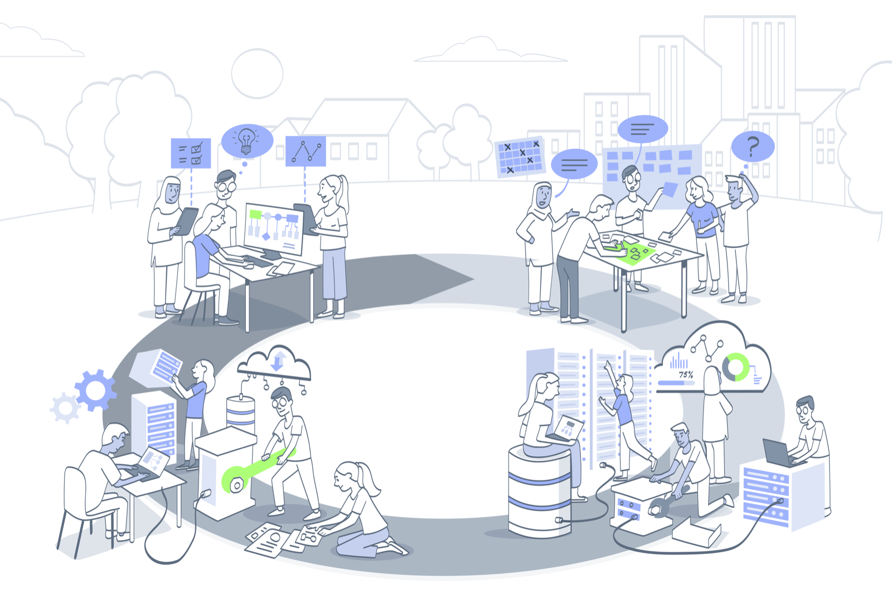

# The AI Project Lifecycle

This repository hosts the files for online guidance about the **AI Project Lifecycle** guidebook.

| Information | Links |
| :--- | :--- |
| **Project** | |

## What is the AI Project Lifecycle

The AI project lifecycle is a model designed by the Public Policy Programme's Ethics and Responsible Innovation Team (Alan Turing Institute) to support reflective and deliberative enquiry for research or development teams.
This guidebook introduces the model, using several illustrative case studies, and shows how the model can be used by regulators and wider stakeholders to identify salient actions or decisions that can be taken throughout the design, development, or deployment stages of a project's lifecycle.
The goal of this model is to foster a more trustworthy and responsible AI ecosystem.
