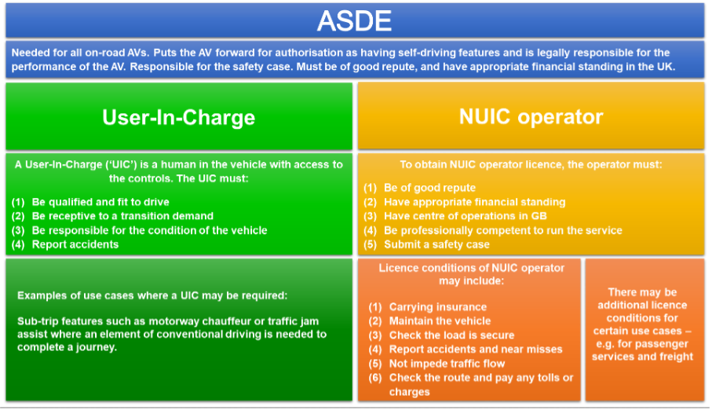

# Recognition: Autonomous Vehicles 
###### tags: `case study`

## 1. Summary

In this case study, we define and discuss the topic of autonomous vehicles (AVs) with respect to algorithmic techniques that engage in Recognition. 

Specifically, we follow a firm through the process of developing and deploying a new AV to market. We examine the definition of Recognition as an AI category, the key classification data for AVs, the applicable regulatory framework for bringing AVs to market (as well as any gaps in the current regulation). We also look at the relevant ethical considerations involved, and the potential parties in the value which chain might be affected.

## 2. Case Study Details
    

### Case Study Description

A company is in the process of deploying to market a new self-driving car. The AV enables a person to sit behind the steering wheel without controlling either the steering or acceleration/braking of the vehicle, but expects the person to pay attention and to take control of the vehicle if an unexpected event occurs. In this case, a "transition demand" notification will ask the user-in-charge to take active control of the vehicle.

As will be discussed in greater length below, some of the main regulatory challenges of getting a viable product to market occur where the level of driving automation is such that the vehicle is self-driving but where a human is still expected to remain in charge when an problem arises which the AV cannot handle on its own (a transition demand).

### Category Definition: What is Recognition?
!!! note " "
    Recognition is the identification of different objects or persons as members of categories based on their specific properties or characteristics.

    In the context of AI, recognition has a wide range of applications (eg identity verification, autonomous navigation), depending on the type of data available (such as text, images, videos, audio, etc). Convolutional neural networks are a common type of AI technique used for recognition (eg facial recognition).

    The output of a recognition task is usually a label or tag which categorises data. For example, in image recognition the label might be “This is a tree”; in audio recognition, “This is the sound of a barking dog”; and in handwriting recognition, “This is a letter C”. 
    
    A model or system can be defined as undertaking a recognition task if it takes either structured or unstructured data as input (D) and generates an output variable (O) that classifies the data input as belonging to some set or category.

### Background

Key terms include:

* “User-in-charge”: The person in the driver’s seat, who is expected to regain control of the vehicle in the event of a transition demand.
* "Transition Demand": An event where the AV would alert the user-in-charge to take charge of the vehicle.
* "No-user-in-charge": Situations where certain features--such as valet parking--might gain regulatory approval such that no humans are expected to be in charge of the vehicle.
* "Authorised Self-Driving Entity": The entity that seeks regulatory approval for automated features and retains legal responsibility for them.

### Key Information
!!! info " "
    - SIC Classification
        - Section: C
        - Class: 29.100 (Manufacture of motor vehiles)
    - Stakeholders and Other Affected Individuals:
        - Users of AVs
        - Other drivers on the road, pedestrians, cyclists, etc.
        - AV manufacturers
        - Value chain parties (see below)
    -Data Types:
        - Sensory Data 
            - External Environment (e.g. LiDAR, Radar, Camera)
            - Internal Environment (e.g. vehicle speed, fuel levels)
        - Geospatial Data (e.g. roads, location)
    - Possible Algorithmic Techniques Employed: 
        - Partially Observable Markov Decision Processes (Decision-Making)
        - Deep Reinforcement Learning (Object Detection)

## 3. Regulatory Considerations

###  Specific Issues

* Ultimate liability: The central question when regulating AVs is who should be responsible when incidents occur. Different jurisdictions have taken different approaches. For instance, France and Germany have made the user-in-charge liable in certain cases, whereas the UK could move toward a 'no-liability for the occupants of the vehicle' model in the case of certain pre-approved features. The proposed UK model is for the Authorised Self-Driving Entity (ASDE) to secure an additional authorisation as a "no-user-in-charge operator". Here, the ASDE would have legal liability rather than the individuals using the AV. This distinction is captured in the image below:

When is the ASDE actually at fault? Should liability lie with the ASDE or with the occupants of the vehicle?

###  Existing and Proposed UK Regulation or Legislation

The UK is likely to make this distinction on a feature by feature basis. Special legal accountability rules will apply depending on whether a certain feature requires a user-in-charge:
1.	If there is a user-in-charge: This person will be responsible for insurance and checking loads, and of taking over control over the car in response to a “transition demand” situation where the vehicle encounters an issue. This person will have immunity from driving functions such as dangerous or careless driving, speed checks, or running a red light.
2.	In some cases, the vehicle can be approved on behalf of an Authorised Self-Driving Entity (or ASDE) as capable of having “no user-in-charge” (NUIC). NUIC features are those where all occupants of the vehicle are passengers and no one is a user-in-charge. Legal responsibility for safe driving would lie with a licensed NUIC operator.
4.	The Automated and Electric Vehicles Act 2018 will govern civil liability questions. Injured parties would not need to prove fault, but would instead be directly compensated by insurers.

Other regulatory considerations:

* "Passivity Problem": People find it more difficult to monitor a task passively than to be actively engaged in it. A person might be sitting behind the wheel, but once the vehicle is self-driving, that person will not engage their full attention to driving and will have limited ability to respond appropriately to events.
* "Vulnerable users": AVs should not put some groups at greater risk. For instance, vulnerable road users may include pedestrians, cyclists, motorcyclists and horse riders. Moreover, risk should not be increased for groups falling into protected characteristics, such as disability or age. For instance, testing may have been insufficient to determine an AV’s safety impact on wheelchair users. The ASDE should conduct an equality impact assessment when approving AVs.
* Equality: As a public authority, the Secretary of State is subject to the public sector equality duty. The expansion of AI-technologies into public roads means that public authorities must take the interests of protected groups into consideration when updating licencing and road safety laws.
* "Transition Demand": To what extent should a user-in-charge  be expected to respond to events? Should a user-in-charge be liable in the absence of a transition demand from the AV to the person in the driving seat? For instance, German legislation requires users to respond to “obvious circumstances,” and French legislation requires users to respond to emergency services vehicles. The Law Commission of England and Wales and the Scottish Law Commission take the view that these exceptions require too much if the user is not normally expected to pay attention to the driving task. Instead, they state that an  automated driving system (ADS) feature must be safe even in the absence of human intervention; in case of events such as floods or emergency vehicles, the AV should issue a transition demand to the user-in-charge or come to a safe stop.
* "Duty of Candour": Organisations responsible for AVs would have a duty of candour regarding any incidents, making it a criminal offence to (1) fail to provide information to the regulator or (2) provide information to the regulator that is false or misleading. 
* Privacy laws and data protection: AVs will record and store data, including local data, to permit analysis of vehicle collisions.  ASDEs will be responsible for ensuring that AV data complies with data protection laws. 

### Gaps in Current Framework
    
* Regulatory gap: As currently conceived, EDRs will not record details of individual vehicles. They cannot be used to investigate individual incidents. AVs will need to store more data than are captured by EDRs alone. 
* Cybersecurity issues: One safety issue is the potential for interference with AVs, ranging from computer hacking to interfering with a vehicle’s sensors. Hacking is a criminal offence under the Computer Misuse Act 1990. Existing laws would likely cover most instances of intentional interference with AVs. However, section 25 of the Road Traffic Act 1988 must be amended it to make it an offence to tamper with any significant part of an AV.
* Marketing: Marketing must also be monitored, as consumers should not be given the misleading impression that they have no responsibilities in an AV. Furthermore, marketing must not mislead consumers into thinking vehicles have self-driving capabilities greater than they are in reality. On the flip side, marketing should not be used as a way to avoid liability (e.g. Tesla using Beta software and placing liability on the shoulders of the user).

### Socioeconomic Value Chains

Legal liability for AVs ultimately lies with the ASDE. The ASDE must conduct an equality impact assessment and submit it alongside a safety case for the AV in question. As the [Law Commission of England and Wales & the Scottish Law Commission have noted](https://s3-eu-west-2.amazonaws.com/lawcom-prod-storage-11jsxou24uy7q/uploads/2022/01/Automated-vehicles-joint-report-cvr-03-02-22.pdf), there might be an opportunity to meet the needs of an underserved population: 

> One of the main advantages of AVs is their potential to make life better for those with disabilities. They provide hope to people currently unable to drive that they may be able to own a car. They also have the potential to offer new forms of on-demand services.

Other parties affected include:

* Insurers
* Certifying companies
* Marketing companies
* User education companies
* The issuance of “interim passenger permits”  would allow passenger service providers to have conditional operational approval of AVs pending further evidence on how AVs interact with passenger safety and accessibility
* Other impacted industries -- providers of vehicles such as bicycles, motorcycles, scooters, etc.

### Harms and Benefits

Based on initial empirical results, AVs are expected to be a lot safer than human drivers. The question is how much safer they must be relative to humans in order for us to accept their rate of incidents.

AVs operate with incomplete knowledge of their environment. This happens because their sensors are, typically, designed to measure some specific properties of the environment, but have limitations in terms of their range and accuracy. These can include possible occlusions (e.g. inability to perceive one object behind another) or latency issues (i.e. the time it takes for the sensor and system to process information in a dynamic environment.

As such, AVs are inherently probabilistic in how they operate. That is, the accuracy with which they recognise objects can be expressed in probabilistic terms (e.g. a confidence rating). Furthemore, they can possess priors about their environment, which are constantly updated as new information is collected. For instance, an AV could have a high prior belief of encountering a car on the road, and a low prior belief of encountering a horse and cart. The ability for AVs to take decisions based on the available information is, therefore, a complex combination of current and prior information.

Beyond the regulatory issues discussed above, other ethical issues involving potential harms include:

* Practical decision-making: How should the AV decide whom to protect? 
* When is an ADS good enough? An ADS is the combination of software and hardware that perform the driving task. A vehicle may have several ADS features.
* Explainability of AV systems: What level of explainability is morally expected when incidents occur? Who are the moral agents responsible for collisions and deaths?

